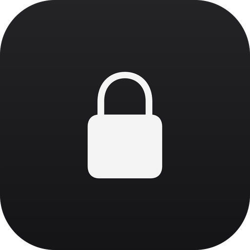
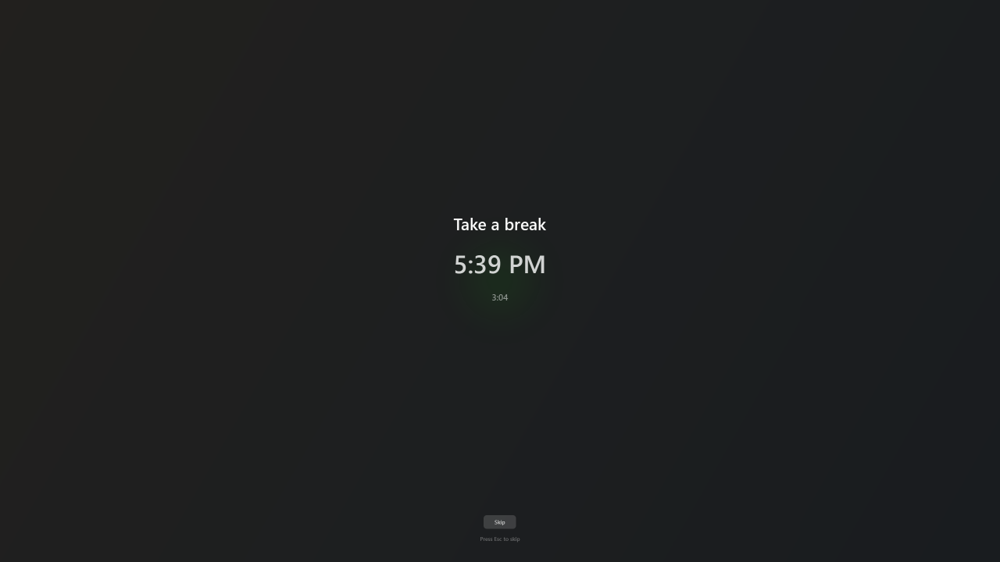
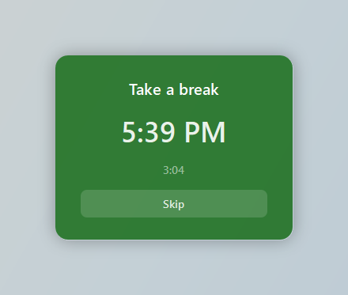
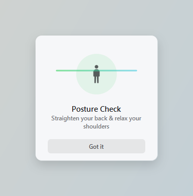
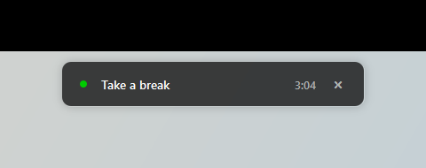
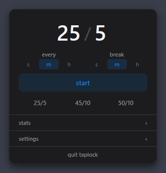
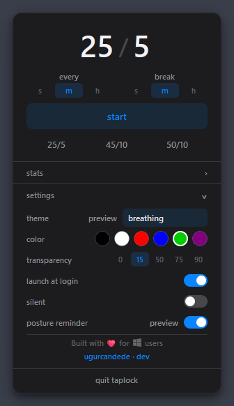
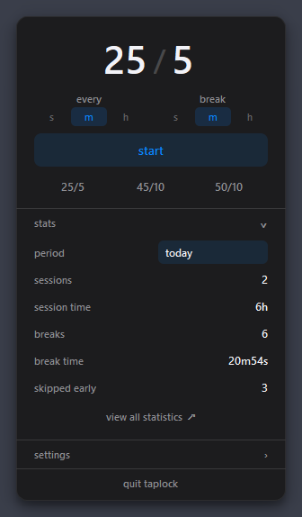
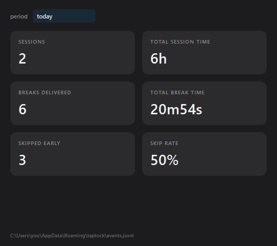

<div align="center">
  
  <h1>TapLock for Windows</h1>
  <p>Periodic break reminders with calming full-screen overlays.<br><strong>Never blocks your input</strong></p>
  <br>
  
  
  
  <a href="https://github.com/ugurcandede/taplock-windows/actions/workflows/build.yml"></a>
</div>

---

> The original is **[taplock-app](https://github.com/ugurcandede/taplock-app)**,
> a menu bar app for macOS. This repository is its **Windows port**, and covers
> relax mode only.

Work for an interval, get a quiet overlay telling you to take a break, repeat.

Lock mode is deliberately not ported. Relax mode never intercepts keyboard or mouse input, so this app stays entirely in
user space: **no keyboard hook, no driver, no administrator rights.**

## The TapLock family

| Repository                                                | Platform |                                                                      |
|-----------------------------------------------------------|----------|----------------------------------------------------------------------|
| [taplock](https://github.com/ugurcandede/taplock)         | macOS    | The command-line tool, and `TapLockCore` where relax mode is defined |
| [taplock-app](https://github.com/ugurcandede/taplock-app) | macOS    | The menu bar app — **the original this port follows**                |
| taplock-windows                                           | Windows  | This repository                                                      |

The Swift source is the specification: where behaviour was ambiguous it was read from `RelaxingSession.swift` and
`RelaxingWindow.swift` rather than guessed, and every place this port deliberately parts company with it is listed under
[Differences from macOS](#differences-from-macos).

Config and log files use the same schema on both platforms on purpose, so the two builds can share them.

---

<div align="center">
  
</div>

---

## Features

|    |                                                                                               |
|----|-----------------------------------------------------------------------------------------------|
| ⏱️  | **Break cycle** — work for an interval, break, repeat. Seconds, minutes or hours              |
| 🎨 | **Three overlay themes** — breathing, minimal, mini                                           |
| 🧍 | **Posture reminder** — a nudge halfway through each interval, dismissable and optional        |
| 🔔 | **Sound cues** — Windows system sounds at the start and end of a break. Silent mode available |
| 📊 | **Statistics** — sessions, break time and skip rate, by period                                |
| 🌗 | **Follows your theme** — light and dark, switched live with Windows                           |
| 🚀 | **Launch at login** — optional, per-user, no elevation                                        |

## Themes

| Theme         | Description                                                                   |
|---------------|-------------------------------------------------------------------------------|
| **breathing** | Full-screen dark wash with a softly pulsing accent disc. Covers every display |
| **minimal**   | A glass card in the middle of the screen, over a blurred backdrop             |
| **mini**      | A small bar at the top of the screen. Never takes focus, so it can be ignored |

<div align="center">
  
  &nbsp;&nbsp;
  
  <br><br>
  
</div>

Colour, transparency and theme are all set from the panel, with a five-second preview button for each.

## Install

Download **`TapLock.exe`** from the
[latest release](https://github.com/ugurcandede/taplock-windows/releases/latest) and run it. A single file — nothing to
extract, nothing to install.

The executable is unsigned, so SmartScreen may stop it the first time — choose **More info → Run anyway**.

The app has no main window: it lives in the notification area. Click the tray icon to open the panel, and turn on
**launch at login** from settings if you want it back after a reboot.

<details>
<summary>Run from source instead</summary>

```bash
git clone https://github.com/ugurcandede/taplock-windows.git
cd taplock-windows
python -m venv .venv
.venv\Scripts\activate
pip install -r requirements.txt
python main.py
```

</details>

## Usage

1. Click the tray icon
2. Enter an interval and a break length, or pick a preset (25/5, 45/10, 50/10)
3. Click **start**

<div align="center">
  
  &nbsp;
  
  &nbsp;
  
</div>

The tray icon fills in and turns green while a session runs, and its tooltip carries the countdown. Right-clicking it
offers **Stop session**.

During a break, **Skip** or <kbd>Esc</kbd> dismisses the overlay and restarts the interval. The mini theme has no <kbd>
Esc</kbd> — it never takes focus, so it cannot steal your caret mid-sentence; use its close button instead.

## Statistics

The panel carries a summary for today or either of the last two weeks. **view all statistics** opens the full window,
which adds months, years, all time, and a custom date range.

<div align="center">
  
</div>

## Usage stats

TapLock sends anonymous usage events to Google Analytics — which features you
use and how, with a random install id. **No keystrokes, no input data, no device
names.** Turn it off any time by unchecking **send anonymous usage stats** in
settings.

## Where things are kept

The first two files use the same schema as the macOS build, so a config or a log can move between machines:

```
%APPDATA%\taplock\relax-config.json    settings
%APPDATA%\taplock\events.jsonl         append-only event log
%APPDATA%\taplock\relax-running        present while a session runs (resume after restart)
%APPDATA%\taplock\analytics.json       usage stats install id and unsent events
%APPDATA%\taplock\update-dismissed     the update banner version you hid
```

The log is never rewritten. Events from a macOS install are read as they are, including `lock_completed` records this
build has no use for.

## How it works

- **One 1 Hz tick** drives the whole session against monotonic deadlines. A deadline found more than 30 seconds overdue
  means the process was not running — a suspended laptop, usually — so the interval restarts rather than firing a break
  hours late.
- **Overlays are Pillow-composited.** The breathing disc is a blurred sprite generated once per accent colour and scaled
  per frame; the glass themes are backed by a still of whatever they cover, blurred and tinted. Qt has no live backdrop
  blur, and re-blurring the screen every frame is not an option.
- **Nothing is hooked.** The overlays are ordinary always-on-top windows.

## Differences from macOS

Where the port does not match the original, it is on purpose:

|                 |                                                                                     |
|-----------------|-------------------------------------------------------------------------------------|
| Tray icon       | Windows cannot show text next to a tray icon, so the countdown lives in the tooltip |
| mini theme      | Never takes focus, so it has no <kbd>Esc</kbd>                                      |
| breathing theme | Covers every display; the glass themes open only where the cursor is                |
| Sounds          | Two per cycle, not three — the chime ten seconds before a break is gone             |
| Settings        | Saved on every change, not only when a session starts                               |
| Week boundary   | Monday (ISO 8601); macOS follows the system calendar                                |

## Requirements

**Windows 10 version 1809 (build 17763) or later, 64-bit.** The floor comes from Qt and CPython, not from this code; the
app checks at startup and says so plainly rather than failing deeper in.

Runtime dependencies are PySide6 and Pillow — see `requirements.txt`.

## Credits

Leaf and figure icons from [Icons8](https://icons8.com).

## Licence

Source Available — free to use, not to modify or redistribute. See [LICENSE](LICENSE).
